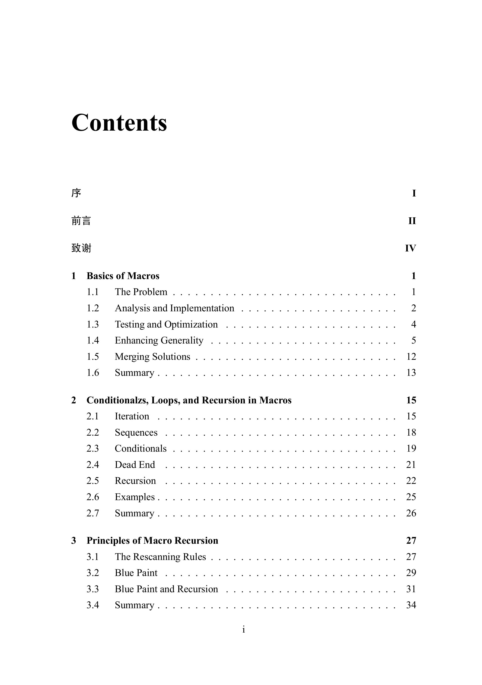
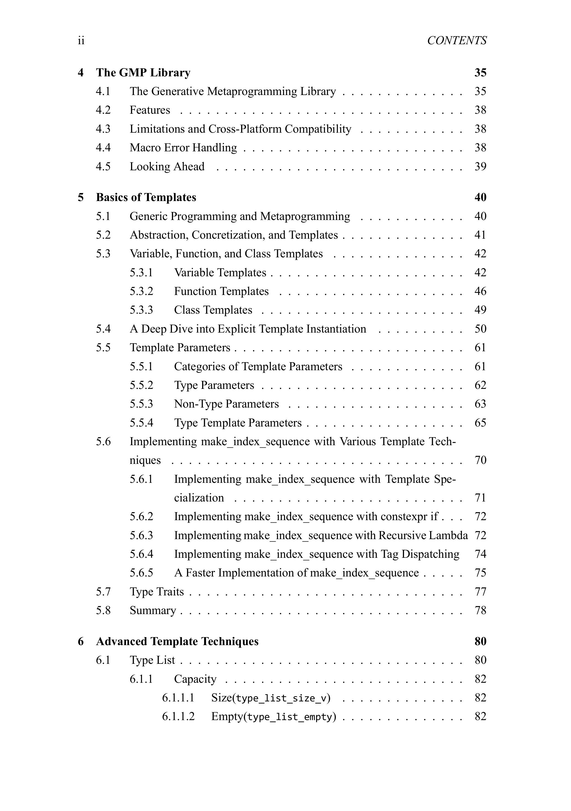
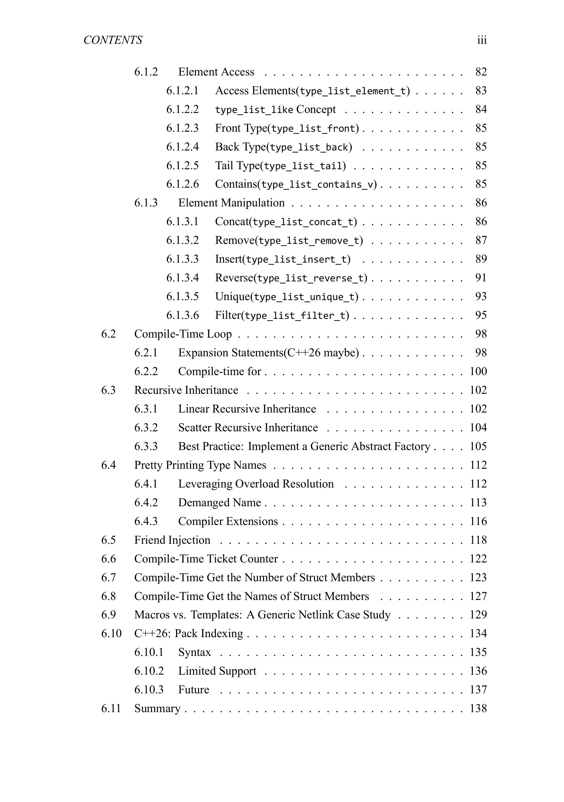
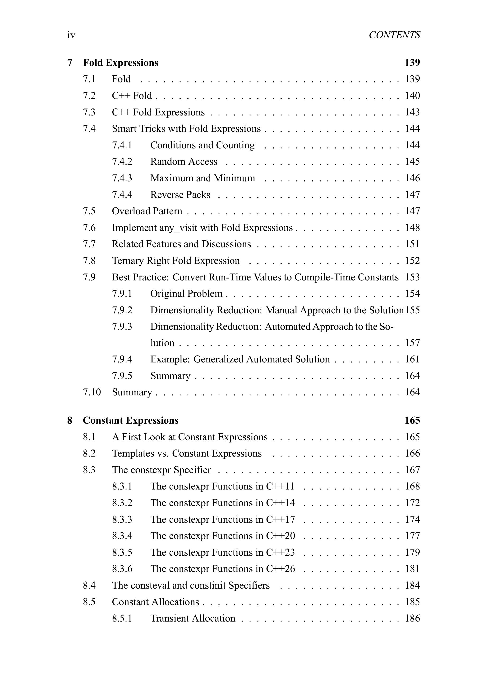
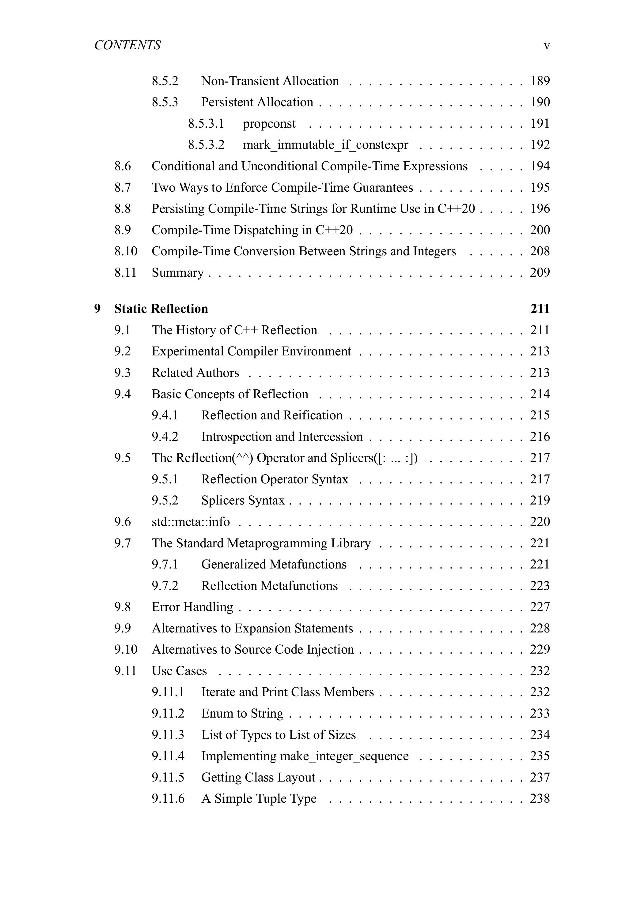
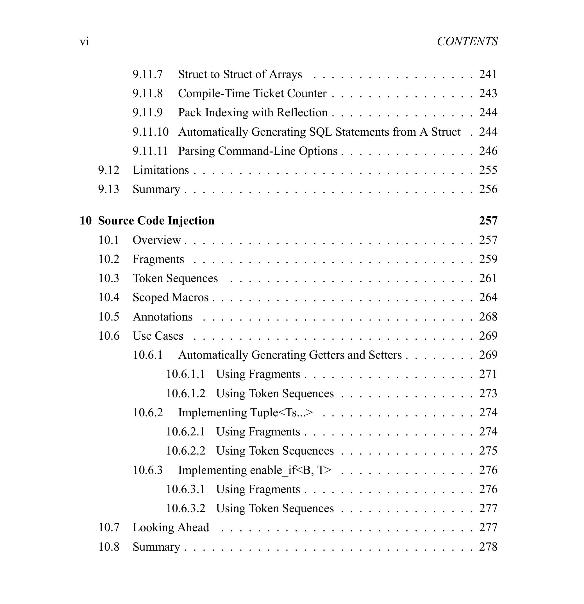

# C++ Generative Metaprogramming

下载地址：[点击下载](https://github.com/lkimuk/cpp-generative-metaprogramming/releases/tag/v1.0)
堪误表：[Errata](https://www.cppmore.com/cpp-generative-metaprogramming-errata/)

岁月不居，时节如流，一载光景，倏忽已逝。

十月，我停掉所有零散文章的更新，转而去完成 C++ Generative Metaprogramming 一书。光阴迅速，经秋至冬，见了些寒蝉鸣败柳，夜雪堕枝头，作品渐成。

该书写来纯属偶然，原是当作一个系列连载，不过内容过深过长，已非系列所能承载。知识忌零散，读多少文章不是目的，构建系统、创造体系才是关键。本系列已形成独立的体系，每章之间，各有关联，遂升维成书，亦是水到渠成之事。

C++ 元编程相关的书，内容主要集中于模板元编程，当前没有系统讲解现代 C++ 产生式元编程的书籍。而随着静态反射进入标准，产生式元编程将迎来新一轮的显著增强，这一次影响深远，是继 C++11 以来变化最大的一次。因此，对 C++ 产生式元编程的发展历史形成系统的认识很有必要，本书内容从 C++98 持续到 C++26（甚至更远），写的就是这部分空缺。

目录：

本书的目标读者为已经具备多年 C++ 开发经验的高级程序设计者。

本作品采取完全免费的形式发布，非正式出版物，读者可以免费获取、阅读、分享，但不得用于任何形式的商业目的，包括但不限于出售、出租、作为商业培训课程教材收取费用、用于商业广告宣传以获取经济收益等行为，仅限于个人学习、研究、欣赏，或是在非营利性的教育、学术交流等活动中使用。

当前只准备了 PDF 版本，EPUB 形式转换尚有一些格式问题，后续提供，单独通知。

另外，今年没有开放过社群，主要原因是一群已满，精力不足，不便轻易开二群。本书内容过深过新，下周会开一个无门槛的读者群，没有社群中诸多形式的分享，仅用于 C++ Generative Metaprogramming 的技术讨论和问题反馈/答疑。读者群生命周期有限，遗留下来的活跃读者，将可以进入新社群。也就是说，今年不会再单独设置问题开放社群，而是通过无门槛读者群的形式筛选具有 C++ 基础的人，构建二群。

本书乃抽空而写，免费发布，只经过一轮的初步校对，如发现问题，请在发布地址或读者群反馈。当然也存在未及充分完善的章节，抑或是语言上的瑕疵，完美主义是永远无法按照预期完成目标的，所以本次暂且这样。迨至二月，C++26 正式定论后，也许会再来完善，届时所有反馈的问题也将一并修复。

便以此书，飨与诸位，提前祝大家 2025 新年快乐！ 